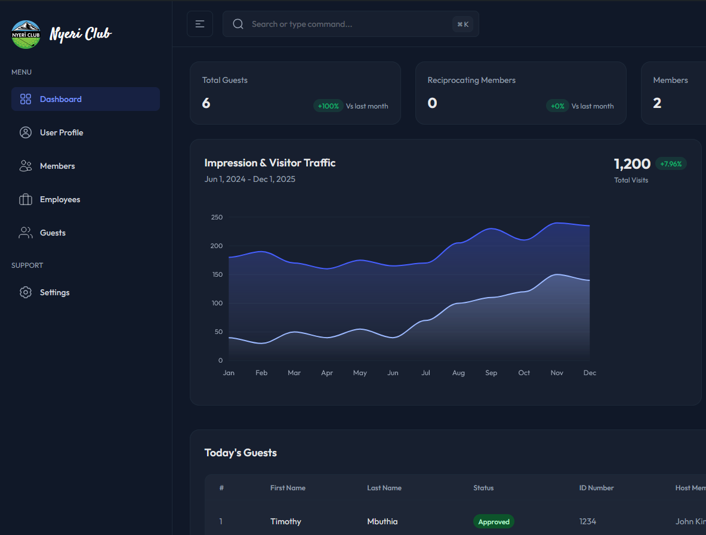

# Visitor Management System (VMS) Plugin

**Contributors:** Wilson Mbuthia (wyllymk)  
**Tags:** visitor management, guest tracking, access control, wordpress plugin  
**Requires at least:** 6.0  
**Tested up to:** 6.8.3  
**Requires PHP:** 7.4  
**Stable tag:** 1.0.0  
**License:** GPLv2 or later  
**License URI:** https://www.gnu.org/licenses/gpl-2.0.html

A comprehensive visitor management system for clubs and organizations, built with WordPress. Track guests, manage access, send notifications, and maintain detailed visitor logs.

## Description

The Visitor Management System (VMS) Plugin provides a complete solution for managing visitors, guests, and access control in club environments. The system supports multiple user roles with specific permissions and capabilities, ensuring secure and efficient visitor management.

### Key Features

-   **Multi-role User System**: Support for Members, Chairman, General Manager, Reception, Gate, and Admin roles
-   **Guest Registration & Tracking**: Register guests with visit dates, host information, and status tracking
-   **Automated Notifications**: SMS and email notifications for visit updates and status changes
-   **Visit Limits & Enforcement**: Automatic enforcement of monthly (4 visits) and yearly (24 visits) limits
-   **Real-time Sign-in/Sign-out**: Track guest arrival and departure times
-   **Comprehensive Reporting**: Detailed reports and analytics for management
-   **Audit Trail**: Complete logging of all system activities

### System Capabilities by User Role

#### 🔐 **Member**

Members can manage their own guest visits and view their visit history.

**What Members Can Do:**

-   Register guests for future visits (up to 4 per month, 24 per year)
-   View and manage their registered guests
-   Cancel upcoming visits
-   Receive notifications about visit status changes

**Member Workflow:**

1. **Registration**: Members register through the system and are approved by reception
2. **Guest Registration**: After approval, members can register guests for specific dates
3. **Visit Management**: View upcoming visits, cancel if needed
4. **Notifications**: Receive SMS/email updates about visit approvals and changes

#### 👑 **Chairman**

Chairmen have elevated privileges for guest management and system oversight.

**What Chairmen Can Do:**

-   Register personal guests for visits
-   Register courtesy guests (without host requirements)
-   View comprehensive reports across the system
-   Access supplier, accommodation, and reciprocation member information
-   Edit system data (same permissions as General Manager)
-   Receive detailed system analytics

**Chairman Workflow:**

1. **Guest Registration**: Register personal guests or courtesy guests directly
2. **System Oversight**: Access reports on visitor activity, system usage
3. **Data Management**: View and edit supplier, accommodation, and club information
4. **Approval Authority**: Can approve special visit requests

#### 🏢 **General Manager**

General Managers handle high-level administrative tasks and system configuration.

**What General Managers Can Do:**

-   Register courtesy guests for the organization
-   Access comprehensive system reports
-   View and edit supplier information
-   Manage accommodation guest records
-   Access reciprocation member data
-   View club-related information and analytics

**General Manager Workflow:**

1. **Courtesy Guest Management**: Register guests who don't have specific hosts
2. **System Monitoring**: Review reports on visitor patterns and system performance
3. **Supplier & Partner Management**: Maintain supplier and accommodation provider records
4. **Reciprocation Oversight**: Manage reciprocal club member access

#### 🚪 **Gate Staff**

Gate staff handle physical access control and guest verification upon arrival.

**What Gate Staff Can Do:**

-   Register accommodation guests arriving at the gate
-   Register suppliers and delivery personnel
-   Register reciprocation members from partner clubs
-   **Cannot** register regular guests arriving at the gate (must be pre-registered)
-   **Cannot** perform sign-in operations (handled by reception)

**Gate Staff Workflow:**

1. **Arrival Verification**: Check pre-registered guests against ID/passport
2. **Accommodation Guests**: Register walk-in accommodation guests
3. **Supplier Registration**: Register suppliers and service providers
4. **Reciprocation Members**: Register members from reciprocal clubs
5. **Access Control**: Manage physical entry based on registration status

#### 🏨 **Reception Staff**

Reception staff are the primary point of contact for visitor management and system administration.

**What Reception Staff Can Do:**

-   Register guests on behalf of members
-   View, edit, and update guest information
-   Cancel visits on behalf of members
-   View, edit, and update member information
-   Manage supplier records
-   Handle accommodation guest registrations
-   Process reciprocation member visits
-   Perform guest sign-in and sign-out operations
-   Approve member registrations

**Reception Staff Workflow:**

1. **Member Registration**: Process new member applications and approvals
2. **Guest Registration**: Register guests for members who call ahead
3. **Visit Management**: Handle visit cancellations, modifications, and status updates
4. **Sign-in/Sign-out**: Process guest arrivals and departures with ID verification
5. **System Maintenance**: Update member and guest information as needed
6. **Supplier Management**: Maintain supplier contact information and access records

#### ⚙️ **Administrator**

Administrators have complete system access and configuration control.

**What Administrators Can Do:**

-   All permissions from all other roles
-   Edit system settings and configuration
-   View audit logs (complete system activity history)
-   Access SMS logs and delivery reports
-   View email logs and delivery status
-   Manage user roles and permissions
-   Configure notification templates
-   Access all reports and analytics
-   Perform system maintenance tasks

**Administrator Workflow:**

1. **System Configuration**: Set up notification preferences, limits, and rules
2. **User Management**: Create and manage user accounts and roles
3. **Audit & Monitoring**: Review system logs for security and compliance
4. **Report Analysis**: Access detailed analytics on system usage
5. **Maintenance**: Perform system updates, backups, and troubleshooting

## Installation

### Minimum Requirements

-   WordPress 6.0 or higher
-   PHP 7.4 or higher
-   MySQL 5.6 or higher
-   HTTPS recommended for security

### Installation Steps

1. **Download and Install**

    - Download the plugin zip file
    - Upload to `/wp-content/plugins/` directory
    - Activate through WordPress admin > Plugins

2. **Database Setup**

    - Plugin automatically creates required tables on activation
    - Custom database tables: `wp_vms_guests`, `wp_vms_guest_visits`

3. **Initial Configuration**

    - Set up SMS gateway credentials in settings
    - Configure email notification templates
    - Set up user roles and permissions

4. **User Setup**
    - Create user accounts for different roles
    - Assign appropriate capabilities
    - Configure notification preferences per user

## User Role Capabilities Matrix

| Capability                     | Member | Chairman | Gen Manager | Reception | Gate | Admin |
| ------------------------------ | ------ | -------- | ----------- | --------- | ---- | ----- |
| Register Personal Guests       | ✅     | ✅       | ❌          | ✅        | ❌   | ✅    |
| Register Courtesy Guests       | ❌     | ✅       | ✅          | ✅        | ❌   | ✅    |
| Register Accommodation Guests  | ❌     | ❌       | ❌          | ✅        | ✅   | ✅    |
| Register Suppliers             | ❌     | ❌       | ❌          | ✅        | ✅   | ✅    |
| Register Reciprocation Members | ❌     | ❌       | ❌          | ✅        | ✅   | ✅    |
| Cancel Visits                  | ✅     | ✅       | ✅          | ✅        | ❌   | ✅    |
| Guest Sign-in/Sign-out         | ❌     | ❌       | ❌          | ✅        | ❌   | ✅    |
| View Reports                   | ❌     | ✅       | ✅          | ✅        | ❌   | ✅    |
| Edit Member Data               | ❌     | ✅       | ✅          | ✅        | ❌   | ✅    |
| Edit Guest Data                | ❌     | ✅       | ✅          | ✅        | ❌   | ✅    |
| Edit Supplier Data             | ❌     | ✅       | ✅          | ✅        | ❌   | ✅    |
| View Audit Logs                | ❌     | ❌       | ❌          | ❌        | ❌   | ✅    |
| View SMS/Email Logs            | ❌     | ❌       | ❌          | ❌        | ❌   | ✅    |
| System Settings                | ❌     | ❌       | ❌          | ❌        | ❌   | ✅    |

## Visit Limits & Rules

### Guest Visit Limits

-   **Monthly Limit**: 4 visits per guest per month
-   **Yearly Limit**: 24 visits per guest per year
-   Limits are automatically enforced by the system
-   Exceeded limits result in automatic suspension

### Host Daily Limits

-   **Daily Limit**: 4 guests per host per day
-   Courtesy visits don't count toward host limits
-   System automatically adjusts visit statuses based on host capacity

### Status Management

-   **Active**: Guest can make visit requests
-   **Suspended**: Guest has exceeded limits, temporarily blocked
-   **Banned**: Permanently blocked from system access

## Frequently Asked Questions

### For Members

**How do I register a guest?**

1. Log in to your member account
2. Navigate to "Register Guest"
3. Fill in guest details (name, phone, visit date)
4. Submit for approval
5. Receive confirmation via SMS/email

**Why was my guest registration rejected?**
Common reasons:

-   Monthly limit exceeded (4 visits)
-   Yearly limit exceeded (24 visits)
-   Host daily limit reached (4 guests per day)
-   Guest previously banned or suspended

**How do I cancel a visit?**

1. Go to "My Guests" section
2. Find the upcoming visit
3. Click "Cancel Visit"
4. Guest receives cancellation notification

### For Reception Staff

**How do I approve a member registration?**

1. Access pending member registrations
2. Review application details
3. Click "Approve" or "Reject"
4. Member receives notification of decision

**What happens during guest sign-in?**

1. Guest arrives with ID/passport
2. Verify guest details against registration
3. Scan or enter ID number
4. Click "Sign In" - timestamp recorded
5. Guest and host receive confirmation

### For Administrators

**How do I view system logs?**

1. Go to VMS Settings > Logs
2. View Audit Logs for system activities
3. Check SMS Logs for message delivery status
4. Review Email Logs for notification status

**How do I configure notifications?**

1. Access VMS Settings > Notifications
2. Set SMS gateway credentials
3. Customize email templates
4. Configure user notification preferences

## Screenshots

### 1. Member Dashboard

Overview of member's guest registrations and visit history.

### 2. Reception Management Interface

Complete guest and member management interface for reception staff.

### 3. System Reports

Comprehensive reporting dashboard for management oversight.

## Changelog

### 1.0.0

-   Initial release with complete visitor management system
-   Multi-role user system implementation
-   Automated SMS and email notifications
-   Comprehensive reporting and audit trails
-   Visit limits and automatic status management

### 0.5.0

-   Beta release with core functionality
-   Basic guest registration and tracking
-   User role system implementation
-   Initial notification system

## Upgrade Notice

### 1.0.0

Major release with complete visitor management system. All previous data will be preserved during upgrade.

### 0.5.0

First beta release. Backup your database before upgrading.

## Support

For support and documentation, visit:

-   [Plugin Documentation](https://github.com/wyllymk/vms-plugin/wiki)
-   [User Guides by Role](https://yourdomain.com/vms-documentation/)
-   [Support Forum](https://wordpress.org/support/plugin/vms-plugin)

## Development

This plugin is developed with:

-   **WordPress Coding Standards**: PSR-4 autoloading
-   **Composer**: Dependency management
-   **PHPCS**: Code quality assurance
-   **WordPress Roles API**: Custom role management

## License

This plugin is licensed under the GPLv2 or later.
